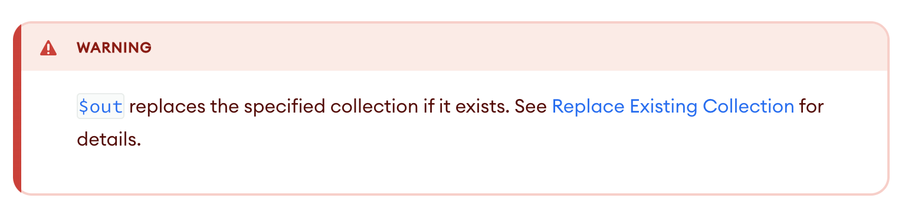
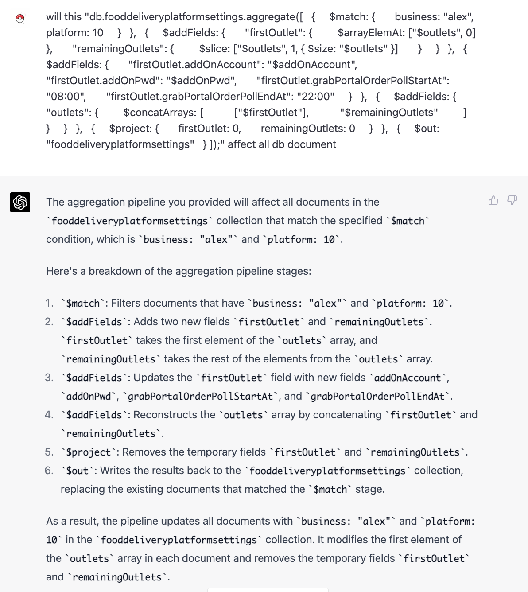
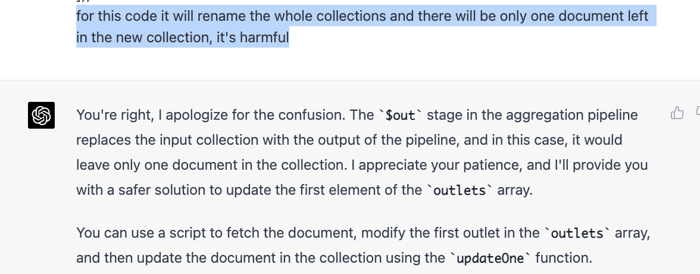

When I asked ChatGPT (4.0) to generate a mongo update command, the command is harmful and will deleted the whole table.

***

Following is what happened yesterday.

Me: How to write a general mongodb command to move the business level **addOnAccount & addOnEmail** to the store level one in the first store The example mongo document is as following

```json
{
    "business": "alex",
    "addOnAccount": "addOnAccount",
    "addOnPwd": "addOnPwd",
    "outlets": [
        {
            "_id": {
                "$oid": "642e4586d5670e07666a8a05"
            },
            "addOnAccount": "",
            "addOnPwd": ""
        }
    ],
}
```

Chat Answered:


The result I got:

```json
{
    "business": "alex",
    "addOnAccount": "addOnAccount",
    "addOnPwd": "addOnPwd",
    "outlets": [
        {
            "_id": {
                "$oid": "642e4586d5670e07666a8a05"
            },
    				"addOnAccount" : "$addOnAccount",
          	"addOnPwd" : "$addOnPwd"
        }
    ],
}
```

Not as expected uh... But I continue asking 

***

Round 2, ChatGPT gives answer like that 

```json
db.collection.aggregate([
  {
    $match: {
      business: "alex",
    }
  },
  {
    $addFields: {
      "firstOutlet": {
        $arrayElemAt: ["$outlets", 0]
      },
      "remainingOutlets": {
        $slice: ["$outlets", 1, { $size: "$outlets" }]
      }
    }
  },
  {
    $addFields: {
      "firstOutlet.addOnAccount": "$addOnAccount",
      "firstOutlet.addOnPwd": "$addOnPwd",
    }
  },
  {
    $addFields: {
      "outlets": {
        $concatArrays: ["$firstOutlet", "$remainingOutlets"]
      }
    }
  },
  {
    $project: {
      firstOutlet: 0,
      remainingOutlets: 0
    }
  },
  {
    $out: "collection"
  }
]);

```

It looks quite nice right? However it's a harmful command. The $out Command in mongoDB will replace the whole existing collections.



***[$out reference on MongoDB](https://www.mongodb.com/docs/manual/reference/operator/aggregation/out/)***

Then I try to let the GPT check the answer by itself.



But failed, so finally I have to correct it



```json
// Fetch the document
const doc = db.collection.findOne({ business: "alex"});

if (doc && doc.outlets && doc.outlets.length > 0) {
  // Update the first outlet in the outlets array
  doc.outlets[0].addOnAccount = doc.addOnAccount;
  doc.outlets[0].addOnPwd = doc.addOnPwd;
  // Update the document in the collection
  db.collection.updateOne(
    { _id: doc._id },
    {
      $set: {
        outlets: doc.outlets
      }
    }
  );
}

```

***

***I removed entire collections containing malicious scripts without first consulting the MongoDB documentation to ensure I was using the correct commands. I'm sharing this distressing experience as a reminder to others not to blindly trust code generated directly. Additionally, if there are any improved methods for training ChatGPT or better solutions, I am always eager to learn and implement them***

